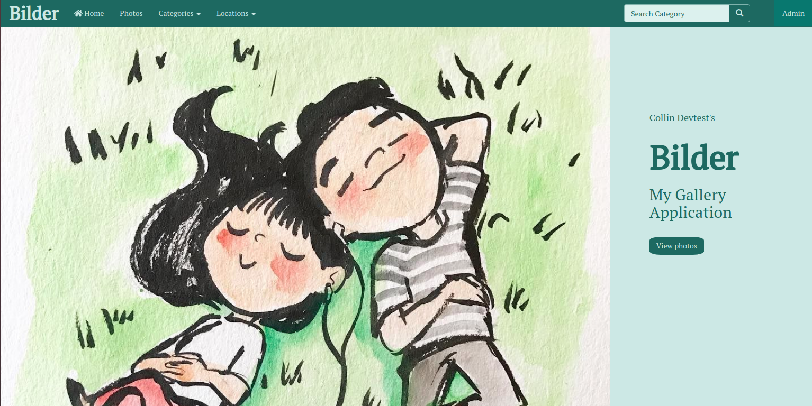

# Bilder
#### A Django personal photo gallery app, 29/06/2020
#### By [Collin Owino](https://github.com/Collin9726)

### [Bilder app](https://mybilderapp.herokuapp.com/)

## Description

<table>
<tr>
<td>
Bilder is a personal web gallery app made with Django. Through the app users can view the photos you post, search for photos by category, sort photos by location, and view a single photo together with it's details and captions. Users are also able to share links to the images they like. 
  
The app has an admin page through which an account owner is able to upload, update or delete an image. Here, they can also create new categories and locations and tag them to their images.
</td>
</tr>
</table> 

#### Latest updated version is on 29th June 2020.

## Technologies used

1. Python v3.6
2. Django 3.0.7
3. Postgres
4. AWS S3 buckets
5. JavaScript
6. HTML & CSS

## Development

The app has been developed with Django 3.0.7. It is hosted on Heroku cloud platform. It uses PostgreSQL database for app models data and AWS S3 buckets to store static media files. The app makes use of dependencies as listed on `requirements.txt`. Testcases have been written for all model methods. It's source code is available on GitHub at https://github.com/Collin9726/Bilder

## Setup & Run instructions
- Clone the repo to your machine
- Create and activate a virtual environment
- Install the dependencies listed on `requirements.txt`.
- Include a `.env` file that provides `SECRET_KEY`, `AWS_ACCESS_KEY_ID`, `AWS_SECRET_ACCESS_KEY` among other environment variables as listed in `.env.sample`
- Run your app on `MODE='dev'` config for debugging purposes.

To contribute to this project on any modules, follow these easy steps:

- Fork the repo
- Create a new branch in your terminal (git checkout -b improve-feature)
- Make appropriate changes in file(s)
- Add the changes and commit them (git commit -am "Improve App")
- Push to the branch (git push origin improve-app)
- Create a Pull request

## Support and contact details
For any queries, issues, ideas or concerns contact [Collin Owino](owino.collin@gmail.com). Your feedback is highly appreciated. 
### [License](LICENSE)
MIT license
Copyright (c) 2020 **Collin Owino**